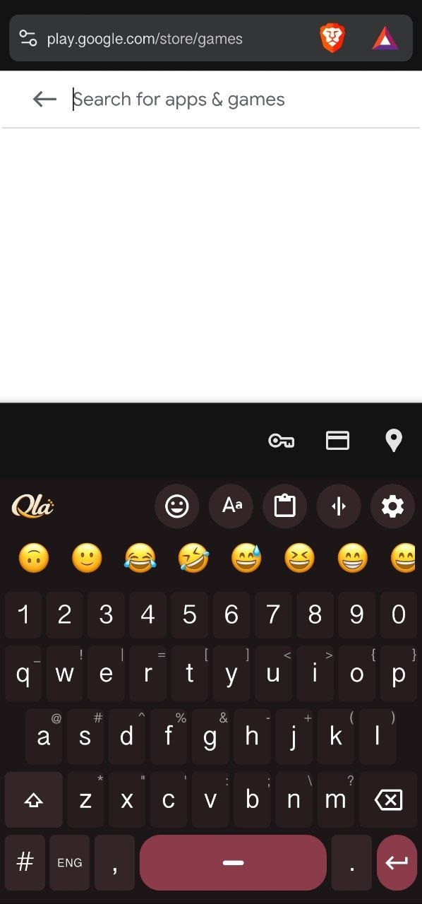
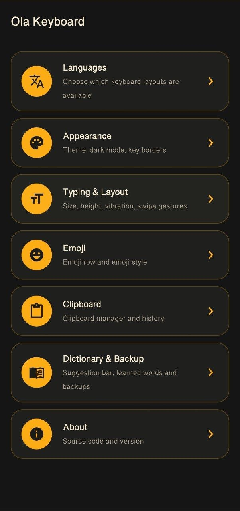
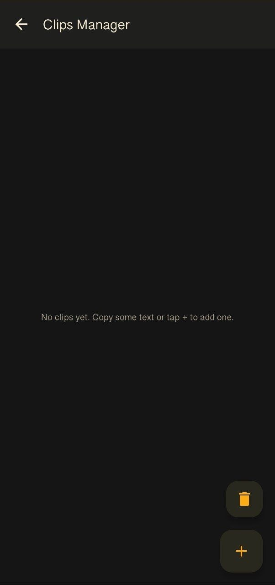

<div align="center">


# Ola Keyboard

**A fast, private, open-source Sinhala &amp; English keyboard for Android**

A customized fork of [Fox Keyboard](https://github.com/xzunk/Foxkeyboard) — rebuilt with a modern Jetpack Compose settings experience, added typing tools, and an in-app update system.

[](LICENSE)
[](#-installation)
[](#-installation)
[](#)

[Features](#-features) • [Screenshots](#-screenshots) • [Installation](#-installation) • [Building](#-building-from-source) • [Credits](#-credits--acknowledgements) • [License](#-license)

</div>

---

## 📖 About

**Ola Keyboard** is a lightweight, privacy-respecting Android keyboard built for typing Sinhala and English with ease. It supports native Wijesekara typing as well as Singlish (typing Sinhala using English letters), and ships with a clean, modern settings screen for customizing everything from themes to typing behavior.

The app collects no analytics and requires no unnecessary permissions — everything runs entirely on-device.

## ✨ Features

### ⌨️ Typing &amp; Layouts
- **English** QWERTY layout
- **Wijesekara** — native Sinhala key layout
- **Singlish** — type Sinhala using English letters
- Live suggestion bar with word predictions, plus a dedicated Prediction Manager
- Swipe-to-erase (swipe left on the top row to delete words)
- Swipe-to-move-cursor
- Adjustable keyboard height and text size
- Optional number row
- Vibration feedback on keypress

### 🎨 Appearance
- Automatic (system) theme or manual Dark Theme
- Optional key borders
- Seven built-in color themes — Ola, Wine, Slate, Ocean, Forest, Onyx, and Navy
- Stylized Unicode font styles for English text

### 😀 Emoji
- Emoji row with recent-emoji tracking
- Choice between system (mobile) emoji and bundled Twemoji-style CC-BY 4.0 font packs — no proprietary emoji art shipped
- Built-in style packs: **Apple Style**, **FluentUI Style**, **OneUI Style**
- Downloadable additional emoji font packs

### 📋 Clipboard Manager
- Full clipboard history, captured automatically as you copy
- Pin important clips
- Smart filters — recently copied, frequently used, mobile numbers, emails, links
- Dedicated Clips Manager to browse, add, or delete saved clips

### 🔄 Backup &amp; Updates
- Export / import your settings and data as a backup file
- Built-in update checker against GitHub Releases, with a settings-icon notification badge — checks run both periodically in the background and whenever the keyboard is opened, so you're notified of new releases without needing to keep the app open

### 🔒 Privacy
- No analytics, no trackers, no ads
- Works fully offline (network is only used for the optional GitHub update check)

## 📸 Screenshots

  <p align="center">
    
    
    
    
  </p>


## 📥 Installation

1. Go to the [Releases](../../releases) page.
2. Download the latest `.apk` file.
3. Install it on your device (you may need to allow "install from unknown sources").
4. Enable **Ola Keyboard** under *Settings → System → Languages &amp; input → On-screen keyboard*.
5. Switch to it from any text field's keyboard-switcher icon.

> F-Droid listing: pending.

## 🛠️ Building from Source

**Requirements:** JDK 17, Android SDK (compileSdk 34), Gradle Wrapper (bundled).

```bash
git clone https://github.com/<your-username>/Ola-Keyboard.git
cd Ola-Keyboard
./gradlew assembleUnicodeRelease
```

The signed release APK will be under `app/build/outputs/apk/unicode/release/`. To sign locally, set the `KEYSTORE_PATH`, `KEYSTORE_PASSWORD`, `KEY_ALIAS`, and `KEY_PASSWORD` environment variables before building.

## 🤝 Contributing

Contributions, bug reports, and feature suggestions are welcome! Please open an [issue](../../issues) or submit a pull request.

## 🙏 Credits &amp; Acknowledgements

This project is a customized fork built on top of **[Fox Keyboard](https://github.com/xzunk/Foxkeyboard)** by **[xzunk (Madusanka)](https://github.com/xzunk)** — Sri Lanka's original open-source, privacy-first Sinhala keyboard for Android. A heartfelt thank you to the original author for creating and open-sourcing the foundation this project builds on. ❤️

Please consider supporting the original project and its author's other open-source work.

## 📄 License

This project is licensed under the **GNU General Public License v3.0**, in keeping with the license of the original Fox Keyboard project it was forked from. See [`LICENSE`](LICENSE) for the full text.
